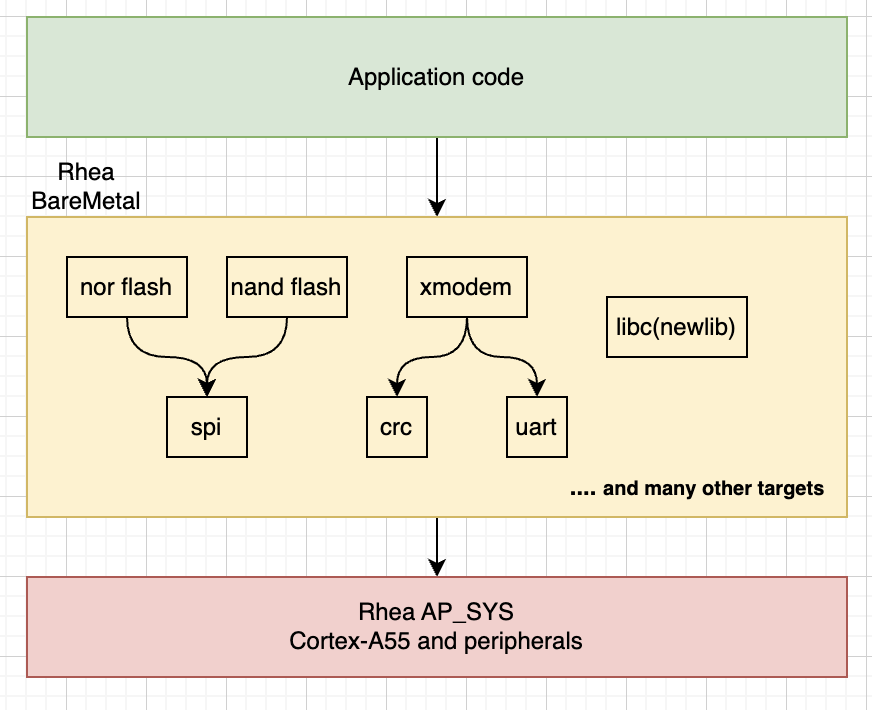
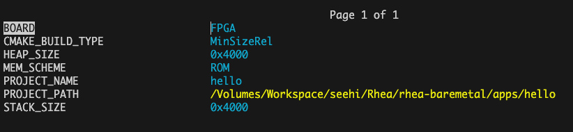
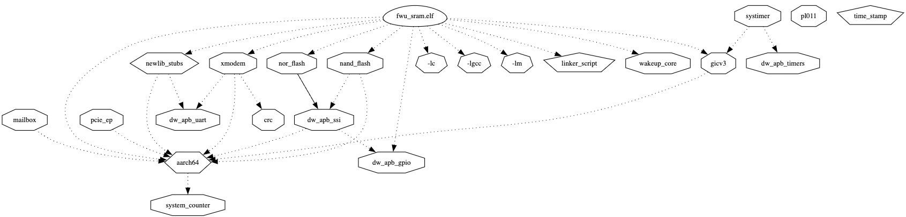
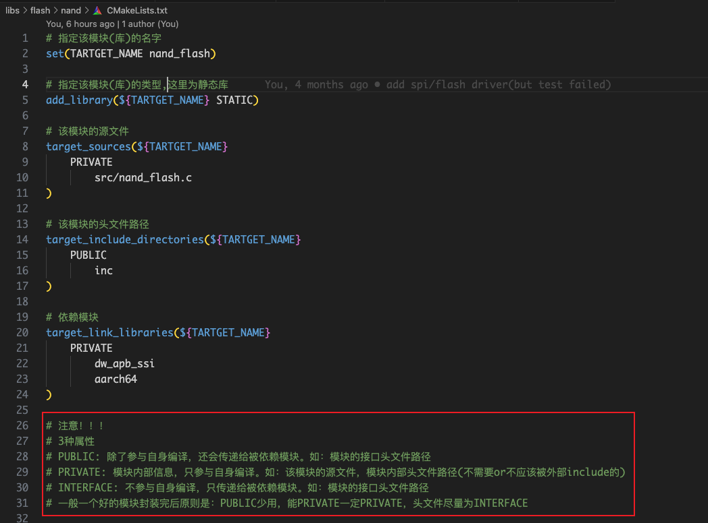
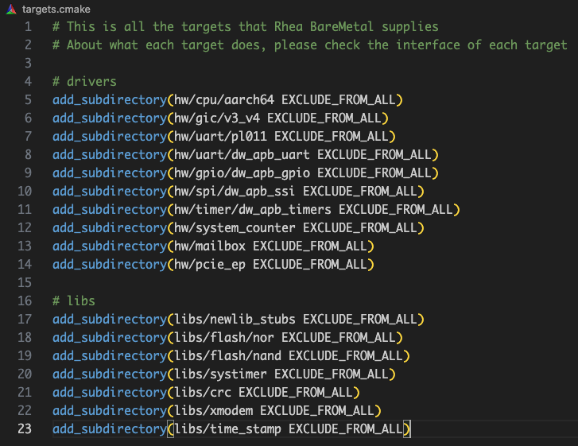

# Rhea BareMetal

Rhea BareMetal提供一个干净的完全可控的裸机开发和测试平台

Rhea BareMetal是由一系列封装成模块的drivers和libs构成的集合，向下对硬件进行抽象，向上为App提供APIs

## Requirements

| Program          | Min supported version |
| ---------------- | --------------------- |
| Arm GNU Compiler | 13.2.rel1             |
| Clang/LLVM       | 18.1.7                |
| CMake            | 3.15                  |
| GNU make         | 3.81                  |
| Ninja            | 1.12.1                |

## Build Options

只提及工程配置相关options, 通过CMake Cache传入, 不包含cmake options(如-S, -B, -G...)

- BOARD: QEMU, RTL, FPGA, EVB. QEMU为qemu virt平台，并非rhea平台.

- CMAKE_BUILD_TYPE: Debug, Release, RelWithDebInfo, MinSizeRel. 默认为Release.

- MEM_SCHEME: ROM, SRAM, DRAM, CUSTOM

- PROJECT_NAME: 设置工程名字(生成的目标文件名字前缀)

- PROJECT_PATH: Path of app.cmake, app.cmake用于添加app sources，headers, dependencies(依赖的targets)

- ...

可以通过ccmake和cmake-gui查看和修改build options, 如下：

## Usage

为了代码复用，提高开发效率，Rhea BareMetal使用模块化思想搭建了整改工程，简单来说该工程就是一个模块集合(这里的模块，在cmake术语中称其为target，很多情况下也可称为静态库，三者在本文中等价)

可以通过--graphviz选项在config阶段生成targets的依赖关系图，如下：

### 对于App开发者

对于app新手，推荐按照如下步骤入手

1. 尝试直接编译和运行apps/hello这个示例工程

2. 通过ccmake查看和尝试各个build options(cmake cache)

3. 新建app工程
   
   1. 如何调用模块，添加app.c和头文件路径，请查看apps/hello/app.cmake

### 对于模块开发者

总的来说只需要两步：

1. 封装好自己的模块

2. 放到Rhea BareMetal模块集合中

#### 封装好自己的模块

1. 准备好模块源代码。硬件驱动应放在hw/，软件库放在libs/

2. 告诉Rhea BareMetal模块的源文件，头文件路径，依赖的模块，编译参数...
   
   1. 首先需要明白一个模块的**2个组成部分**：
      
      1. Interface - 提供给使用者的
      
      2. Private   - 模块内部使用的
   
   2. 一个封装良好的模块，应该尽可能吝啬的给出必须的Interface
   
   3. 可以参考libs/flash/nand/CMakeLists.txt
   
   

#### 放到Rhea BareMetal模块集合中

见targets.cmake，该文件存放了Rhea BareMetal所有模块

## Note

1. build_all.sh会运行所有apps/目录下的build.sh脚本，上传代码前请运行build_all.sh，检查所有工程是否正常运行
